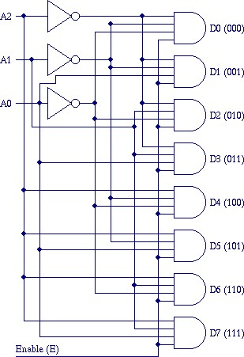

<h3><b>2.Theory</b></h3>

Decode is an electronic combinational circuit which includes basic logic gates (AND, OR, NOT). The circuit take multiple decoded input in the form of n and provide multiple outputs in the form of 2^n. A decoder would be the n-to-2^n type binary decoders. The decoder converts binary information from 'n' coded inputs to 2^n outputs. 2-to-4 decoder, 3-to-8 decoder or 4-to-16 decoder are some examples of Decoder. Decoder is basically used to enable one of the circuit amoung multiple circuit.

 

