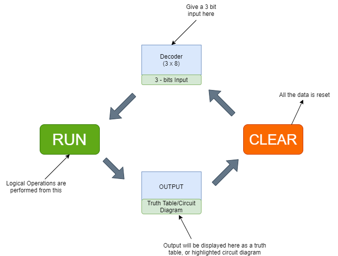

## Storyboard (Round 2)

Experiment 1: 3-8 Line Decoder

### 1. Story Outline:

In digital electronics, a decoder can take inputs in the form of 1 or 0. It has 3 bits inputs and 8 outputs. The coded 3x8 Decoder converts coded inputs into coded outputs, where the input and output codes are different e.g. n-to-2^n, binary-coded decimal decoders. 

### 2. Story:

The simulator display the complete circuit diagram with truth table. The use can give the input in the form of on/off and the simulator will work as the highlighting the circuit by which the input is converted to putput and highlight the row in the truth table. The user can test the truth table based on different inputs. The Decoder is a digital circuit which is a combinational circuit that convert coded binary information from 'n' coded inputs to a maximum of 2^n unique coded outputs. Few examples of Decoder are: 2-to-4 decoder, 3-to-8 decoder or 4-to-16 decoder. Here the silulator is 3x8 decoder.

#### 2.1 Set the Visual Stage Description:
A clear visualization of circuit diagram or logic diagram with block diagram on simulator page. It show the Logic diagram, Block diagram and truth table. The proper animation is ther to verify the truth table of 3x8 Decoder. 

#### 2.2 Set User Objectives & Goals:
Sr. No |	Learning Objective	| 
:--|:-- |
1.| The user will learn and understand the basic knowledge of logic circuit.
2.| The user will learn and interpret the output based on input to the digital circuit of Decoder.
3.| The user will understand the mechanism of combinational circuit designed from basic logic gate and visualize the output generated from th input given to the circuit.

 

#### 2.3 Set the Pathway Activities:

When the user click on simulator tab, it will show simulation page, where circuit diagram of 3x8 decoder with its truth table and block diagram will display. The user need to give input to the decoder and then run the simulator. The simulator will show the output  and highlighted the desired row in the truth. Also the block diagram show the input and output in binary form. The user can input another value after clearing the previous simulation, and can check and verify the whole truth table of decoder.

##### 2.4 Set Challenges and Questions/Complexity/Variations in Questions:

Q.1) How many input in a decoder, if there are 16 output:
 <b>a.	4</b>
 b.	2
 c.	3
 d.	5

Q.2) Can a decoder design with NAND Gate:
 <b>a.	Yes</b>
 b.	No

Q.3)	There is always n input and 2^n output in any decoder.
 <b>a.	Yes</b>
 b.	No

##### 2.5 Allow pitfalls:

##### 2.6 Conclusion:
Combinational logic circuits 3x8 Decoder has been designed and simulated using logic gates.

##### 2.7 Equations/formulas: NA
As the AND Gate out is depends on the input given to AND gate, and the output of AND Gate will be true if all inputs are 1. Therefore: 
O0 = A’B’C’
 O1 = A’B’C
 O2 = A’BC’
 O3 = A’BC
 O4 = AB’C’
 O5 = AB’C
 O6 = ABC’
 O7 = ABC

### 3. Flowchart
 
 

### 4. Mindmap:

### 5. Storyboard :
Storyboard:
 

